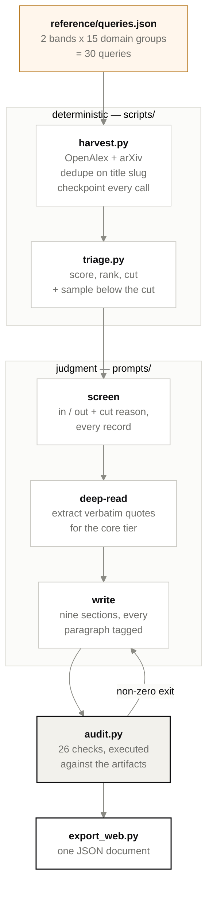
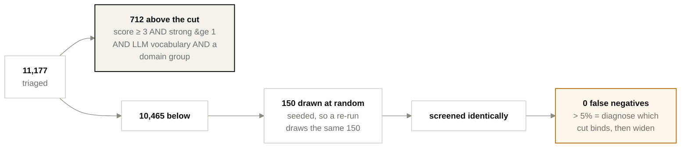

# Deep Research: Agentic AI in Geoscience

A scoping review of **LLM-based agentic AI in solid-earth and subsurface
geoscience**: what has been built, how it was evaluated, and how mature it is.

[](https://github.com/jannablaume/deep-research-agentic-geoscience/actions/workflows/ci.yml)
[](./LICENSE)
[](https://www.python.org/downloads/)
[](./pyproject.toml)
[](https://docs.astral.sh/ruff/)
[](https://mypy-lang.org/)
[](https://pre-commit.com/)

**Descriptive only.** No gap analysis, no research agenda, no claim about where
the field should go next. The one thing it will tell you about an absence is that
a particular query looked for something and did not find it — and it cites the
query.

---

## Start here

The current landscape is **v0.5**. Read in this order:

1. **[the report](outputs/01_landscape/v0.5/report/index.md)** — nine sections,
   `00_executive_summary` through `08_papers`
2. **[RUN.md](outputs/01_landscape/v0.5/RUN.md)** — how the run was done, its
   closing numbers, and what broke
3. **[reference/SCHEMA.md](reference/SCHEMA.md)** — the columns, the tiers, and
   the maturity rubric every claim is graded against

**Or read it as a dashboard.** `make export && make web` builds `web/dist/`,
which opens by double-clicking `index.html` — no server, nothing fetched, and
the folder is sendable as-is. It is the same report with each section beside the
counts it describes, its evidence tags as filters, its citations as links into a
filterable list of all 155 sources, and the verbatim quote behind every
characterisation one click away. The built page is **not** committed — see
[Reading it as a dashboard](#reading-it-as-a-dashboard) for the two commands and
what you need installed.

Earlier directories (`v0.2`, `v0.4`, and anything `-test`) are method tests.
They are kept because a method that was changed should be inspectable, not
because their numbers mean anything.

## Where v0.5 landed

| | |
|---:|---|
| **11,191** | unique records harvested from OpenAlex and arXiv |
| **712** | shortlisted by `triage.py` — 6% of the corpus |
| **10,465** | below the cut, of the 11,177 the cut was applied to<sup>1</sup> |
| **155** | admitted after screening: **23 core**, 132 context |
| **150** | records screened from *below* the cut, to measure what the cut cost |
| **0** | false negatives found in that sample |
| **26/26** | contract checks passed, executed against the artifacts |
| **M4** | highest maturity demonstrated by anything in the corpus. **M5: 0** |

Core means the full text was read and every characterisation of it is backed by
a verbatim quote in `papers.md`. Context means it was counted and annotated, not
deep-read. `M5: 0` — nothing here is in routine use beyond a trial, evidenced by
somebody other than its authors — is a measurement, not an opinion.

---

## How a run works



Everything on the left is a script because none of it needs judgment; everything
in the middle is the model's because all of it does. The v0.1–v0.3 prompts asked
the model to do both halves and spent most of their length trying to stop it
drifting.

| Deterministic → a script | Needs judgment → the model |
|---|---|
| Search, paging, deduplication | Is this record in scope |
| Ranking and the shortlist cut | What does this system actually do |
| Every count and every share | Synthesis, and what the evidence supports |
| Contract compliance | Which subfield a general record belongs to |

The scripts use the **standard library only** — `urllib`, `csv`,
`xml.etree`. `git clone` plus any Python 3.11+ reproduces a harvest with nothing
installed. That is worth more here than the convenience of `requests`: a reviewer
who wants to re-run the corpus should not have to resolve a dependency tree
first.

## The cut is measured, not assumed

A shortlist is a claim that the records below it did not matter. That claim is
usually untested, and it is where a review quietly loses half its subject.



The cut is an **AND of four conditions**, which is why `triage_stats.md` reports
a grid over two knobs rather than one number. If a row is flat across
`min-score`, the score is not what is cutting and lowering it will change
nothing — twice now the binding filter has been structural rather than the score.

## Why you can check any number here

Nothing in the report stands on its own authority. Every claim carries its
evidential status as its first token, and the chain from a sentence to a
published page is three hops long.

```mermaid
%%{init: {
  'theme': 'base',
  'themeVariables': {
    'fontFamily': 'ui-sans-serif, -apple-system, Segoe UI, Helvetica, Arial, sans-serif',
    'fontSize': '14px',
    'primaryColor': '#FFFFFF',
    'primaryTextColor': '#0E0E10',
    'primaryBorderColor': '#C9C8C2',
    'lineColor': '#8A8A84',
    'textColor': '#0E0E10',
    'edgeLabelBackground': '#FBFBF9'
  }
} }%%
flowchart LR
    P["<b>a tagged sentence</b><br/><span style='color:#6F6F6B'>report/05_maturity.md<br/>[Certain] … [[doi:10.…]]</span>"]
    G["<b>papers.csv</b><br/><span style='color:#6F6F6B'>one row per admitted source,<br/>27 fixed columns</span>"]
    E["<b>papers.md</b><br/><span style='color:#6F6F6B'>the author's own words,<br/>quoted verbatim</span>"]
    U["<b>the source</b><br/><span style='color:#6F6F6B'>DOI or arXiv id</span>"]

    P -- "citation key" --> G -- "identity_key" --> E -- "source url" --> U

    style P fill:#F2F1EC,stroke:#0E0E10,stroke-width:1.5px
    style U fill:#FFF6EC,stroke:#B8791F,stroke-width:1px
```



| Tag | Means |
|---|---|
| `[Certain]` | Stated in a source that was read, and quoted in `papers.md` |
| `[Likely]` | Supported but inferred, or read from an abstract only |
| `[Absent-searched]` | Looked for and not found — **and it cites the query id that looked** |

`scripts/audit.py` enforces all of it by parsing the files rather than by asking:
every citation must resolve to a row in `papers.csv`, every core paper must have
an extract block, every substantive paragraph must carry a tag, every absence
claim must name a query, and no promotional wording may appear anywhere. It
exits non-zero, and it replaced a self-attested audit table — the one thing a
long compacted run cannot do is remember its own compliance.

`M5: 0` is what this machinery is for. It is a statement nobody can make honestly
from a reading list.

<sup>1</sup> The two totals differ by 14: the cut was applied to the API corpus,
and 14 grey-literature and snowball records were appended afterwards without
re-triage. `audit.py` allows those extras by name and fails on any other gap
between `triage.csv` and `screened.csv`, so the difference is checked rather
than assumed.

## Running it

```bash
make setup                                  # dev tooling and git hooks
```

Get a free [OpenAlex key](https://openalex.org) and put it in `.env`. It is
effectively required: OpenAlex meters a daily USD budget — $0.10 keyless, $1 with
a key — and a full harvest is ~300 search calls. Keyless, the run aborts partway
through. `harvest.py` refuses to retry a spent budget, because retrying turns one
loud failure into a quiet half-corpus that every later count trusts.

```bash
OUT=outputs/01_landscape/v0.6                # always a new directory

make plan  OUT=$OUT                          # the query plan, calls nothing
make smoke OUT=$OUT-test                     # 3 queries, one periphery group

make harvest OUT=$OUT                        # corpus, checkpointed every call
make triage  OUT=$OUT                        # shortlist + the below-cut sample
#   ... the model screens, deep-reads and writes ...
make audit   OUT=$OUT                        # executed contract check
make export  OUT=$OUT                        # one JSON document for the page
```

The loop is: edit the prompt or `reference/queries.json` → bump the version → run
→ inspect → commit the prompt and the output together.

**Two things that will cost you a day if you skip them.**

`--limit-queries N` is not a smoke test. The plan is core groups first and
periphery starts at q021, so six queries harvest ~1,900 records and zero
periphery — and `07_periphery.md` then cannot be written from harvest counts at
all. Use `make smoke`, which runs one periphery group on purpose.

Never point `triage.py` at a directory that already holds `screening.csv`. It
refuses unless `--force`, and that refusal is load-bearing: regenerating
`shortlist.md` and `audit_sample.md` underneath decisions made against the
previous pair leaves a run that looks finished and measures its recall against a
sample file no longer on disk. Two audit checks exist only to catch it.

> **Working with an agent?** Point it at **[AGENTS.md](./AGENTS.md)** and say
> what you want run. §A walks it through a research pass; §B is for changing the
> scripts. `CLAUDE.md` and `GEMINI.md` are pointers to the same file.

## The maturity rubric

The rubric is the review's most load-bearing judgment, so it is fixed in
[`reference/SCHEMA.md`](reference/SCHEMA.md) and every row is graded twice —
what the authors claimed, and what they demonstrated.

| | |
|---|---|
| **M0** | Position or architecture paper, no working implementation |
| **M1** | Implemented; evaluated only on synthetic or textbook-scale data |
| **M2** | Evaluated on a reusable, site-agnostic benchmark |
| **M3** | Evaluated on real field data from a named site, retrospectively |
| **M4** | Output entered a real workflow or influenced a real decision; site named, time-bounded |
| **M5** | Routine use beyond a trial, evidenced by somebody other than the vendor |

## Repository layout

| Path | What |
|---|---|
| `prompts/` | Versioned research prompts, broad → narrow |
| `.claude/skills/` | **Symlinks** into `prompts/`, so each prompt is a slash command |
| `reference/` | `SCHEMA.md` (columns, rubrics, tiers) and `queries.json` (the query plan) |
| `scripts/` | `harvest.py`, `triage.py`, `audit.py`, `enrich.py`, `export_web.py` |
| `web/` | The static dashboard. Astro; `dist/` opens from the filesystem, `src/data/*.json` is generated |
| `tests/` | Mirrors `scripts/`. `audit.py` is tested by mutation — see [AGENTS.md §B4](./AGENTS.md) |
| `outputs/<prompt>/<version>/` | One directory per run. **Never overwritten** |
| `decisions.md` | Decision log. Each entry says what it *rules out* |
| `docs/architecture.md` | Why it is shaped this way, and what looks wrong until you know why |

A committed run directory is **evidence**. `.editorconfig`,
`.pre-commit-config.yaml` and `pyproject.toml` all exclude `outputs/` so that no
formatter can ever trim whitespace inside one — a cosmetic diff on a run reads
like a method change, and a number edited to match a later recount is a rewritten
record. If a run's numbers are wrong, write a new version.

`screened.csv` and `triage.csv` are gitignored: 22 MB each, and they regenerate
from `reference/queries.json` in minutes. `screening.csv`, `papers.csv` and
`papers.md` are the irreplaceable ones.

## Reading it as a dashboard


**The built page is not in the repository.** `web/dist/` is gitignored, because
it is generated from a committed run and regenerates in seconds. Cloning gets
you the source; one command gets you the page.

### See it, from a fresh clone

```bash
git clone git@github.com:jannablaume/deep-research-agentic-geoscience.git
cd deep-research-agentic-geoscience

make export        # the committed run → web/src/data/landscape.web.json
make web           # that JSON        → web/dist/  (runs npm install for you)

open web/dist/index.html          # macOS
xdg-open web/dist/index.html      # Linux
start web\dist\index.html         # Windows
```

That is the whole procedure. Double-clicking `web/dist/index.html` in a file
browser works identically — there is no server to start and nothing is fetched
at runtime.

**You need Node.** The badge above says the *pipeline* has no dependencies, and
that is true: `python3 scripts/harvest.py` runs on a bare Python 3.11+. The
front end is the one exception — `make web` needs **Node 18.20.8, 20.3+, or 22+**
and npm 9.6.5+ (Astro's own requirement), used only at build time. Nothing Node
touches ends up in the page: the built folder loads no script from a CDN and no
font from a network.

| Want to… | Do this |
|---|---|
| just look at it | `make export && make web`, then open `web/dist/index.html` |
| send it to a colleague | zip `web/dist/` and email it — it opens on their machine with nothing installed |
| change the front end | `make web-dev` → hot reload on <http://localhost:4321> |
| point it at another run | `make export OUT=outputs/01_landscape/v0.6 && make web` |
| add the country facet | `make enrich` before `make export` — needs network, ~3 OpenAlex calls |

If the page opens **unstyled and inert**, you opened `web/src/pages/index.astro`
or a stale `dist/` — rebuild with `make web` and open `web/dist/index.html`. If
`make web` says *"No exported run"*, run `make export` first.

### Why it is a folder and not a URL

The front end is a static [Astro](https://astro.build) site with no runtime
dependencies and no backend: the run is compiled into the page, so a copy of the
folder is a copy of the data. That property is the point — the research
direction is unpublished and lives on institutional infrastructure, so "send a
reviewer the folder" is the distribution method, and a page that only works over
`http://` works for everybody except the person you sent it to.
`web/scripts/relativise.mjs` exists for that one reason, and it is the kind of
bug you cannot see from the machine that built it.

### What the dashboard adds over the markdown

- **A summary table first.** The funnel from 11,191 harvested records to the 23
  with a readable evaluation section, one counted row at a time, each naming its
  denominator and what it counts. The last row is the one that needed care: this
  run cannot say how many sources a paywall cost, because `papers.csv` has no
  paywall column and `access_status: abstract-only` covers paywalls,
  bot-protected nominal open access, software deposits and records with no
  abstract in any API alike — so the row reports what *is* counted and says the
  rest is narrated in `unreachable.md` rather than tallied.
- **Filters second.** The 155-source explorer is the second section, not the
  fifth, because filtering is what most readers came to do.
- **Bibliographic facets** — publication type, journal or venue, and country of
  author institution. Country is the one figure on the page that needs a network
  call (`make enrich`), and the one whose denominator is not the whole corpus:
  97 of 155 sources report an affiliation, because OpenAlex takes them from
  publisher metadata that preprint servers largely do not supply. The panel
  leads with that denominator.
- **The report, re-cut.** Each thematic section sits beside the counts it
  describes rather than in a prose file next to charts it never mentions.
- **Evidence tags as filters.** `[Certain]` / `[Likely]` / `[Absent-searched]`
  become chips, so "show me only what a source actually stated" is one click.
- **Citations that resolve on the page.** Every `[[doi:…]]` is a numbered
  reference marker; clicking it opens that source's full comparison-grid record,
  including — for the 23 core sources — the verbatim sentences from `papers.md`
  that the characterisation rests on.
- **All 155 sources, filterable** by tier, field, architecture, technique,
  framework, maturity, model family and year, with the filtered set
  downloadable as RFC 4180 CSV.
- **One derived facet, labelled as such.** "Frameworks the agents call" is a
  keyword match over `tools_used` and `base_model`, not a `SCHEMA.md` column and
  not covered by any audit check. The page says so everywhere it appears, and
  Method prints the whole keyword list including the terms that matched nothing.

Everything else on the page is either read from a run artifact or counted from
one, and the contract audit is reproduced in full: 26 executed checks, not a
claim of quality.

## Development

```bash
make check      # ruff, ruff-format, mypy --strict, pytest + coverage, hooks, symlinks
```

`make check` must pass from a bare clone — no network, no API key, no run
directory — which is what makes CI meaningful. 200 tests, `mypy --strict` over
`scripts/` and `tests/`, and a coverage floor in `pyproject.toml` rather than on
the command line (at the default precision, `--cov-fail-under` compares the
*rounded* figure, so a run at 64.8% prints FAIL and then exits 0).

[`.github/workflows/ci.yml`](.github/workflows/ci.yml) runs the same gates
across Python 3.11–3.13.

A change to `triage.py`'s scoring is a **method change**: it alters what a re-run
admits, so it belongs in a version bump with a re-triage and a `decisions.md`
entry, never folded into a refactor. Three known scoring gaps are recorded as
`strict=True` xfails so they cannot be fixed by accident.

## Citing

See [CITATION.cff](./CITATION.cff). Cite the version you used — each directory
under `outputs/` is immutable and carries its own `RUN.md`.

## Licence

MIT for the scripts — see [LICENSE](./LICENSE). The report prose and the CSV
artifacts under `outputs/` are © 2026 Janna Blaume, released under
[CC BY 4.0](https://creativecommons.org/licenses/by/4.0/): reuse them with
attribution. Bibliographic metadata comes from
[OpenAlex](https://openalex.org) (CC0) and [arXiv](https://arxiv.org); abstracts
remain under their publishers' terms and are held here only as harvest
artifacts, which is why the two files carrying them in bulk are not committed.
